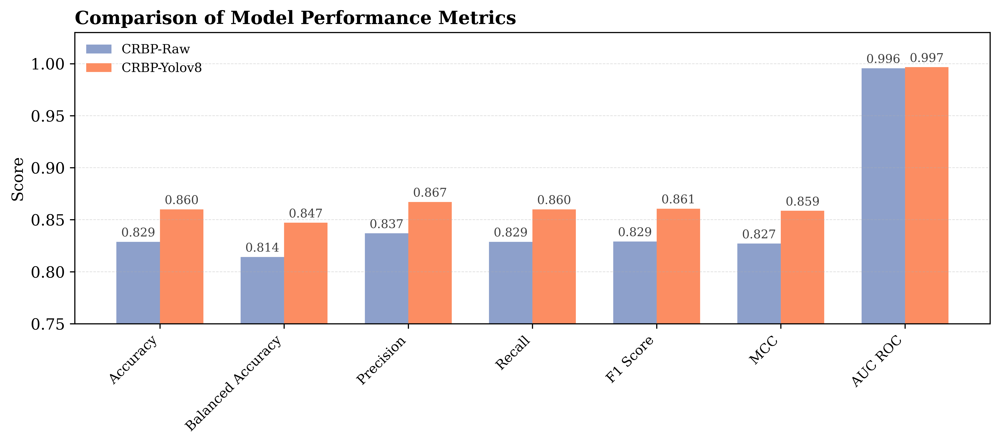
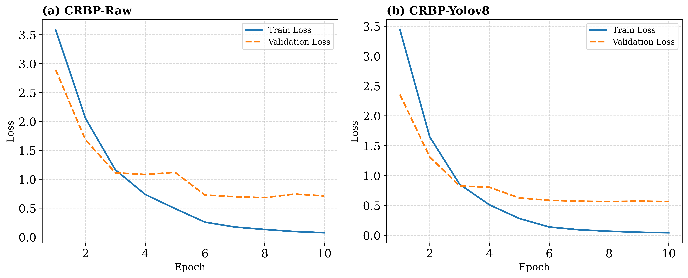

# CRBP: A Benchmark Dataset of Color-Rendered 3D-to-2.5D Facial Projections

**Supplementary:**

1. Histogram of CRBP Raw vs. Yolov8 classification metrics

3. Loss Curves comparison over train and validation

4. Confusion Metrics, PR Curve, and AUC Curve comparison over Raw vs. Yolov8

